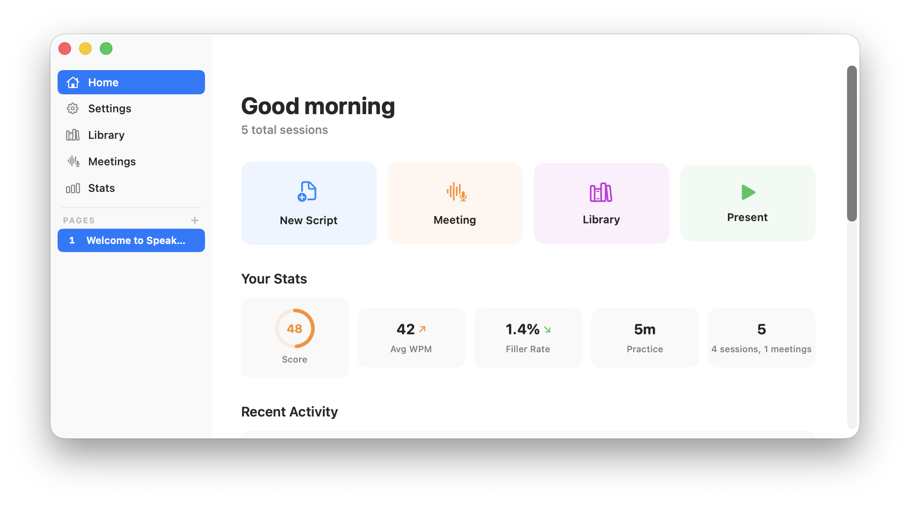
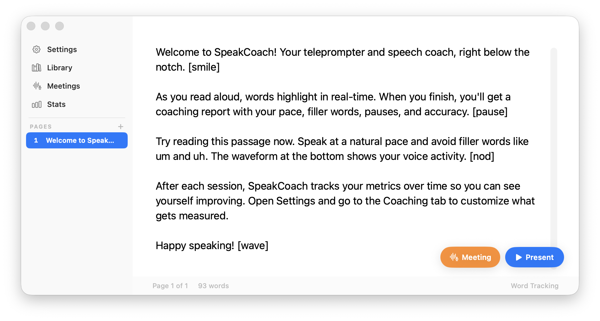
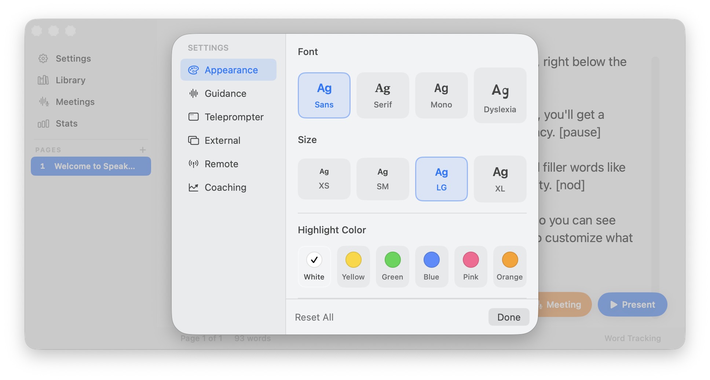

# SpeakCoach

A macOS teleprompter with built-in speech coaching. Track your pace, filler words, pauses, and accuracy in real-time.

  

## How it works

https://github.com/abhitsian/speakcoach/raw/main/screenshots/demo.mp4

Load your script, hit present, and speak — words highlight in real time as you talk. The app tracks your pace, filler words, pauses, and consistency throughout. When you're done, you get a coaching report with a score and breakdown of what to improve.

In meeting mode, no script is needed. Start it during any call, check off talking points as you cover them, and review a full report with transcript after.

## Screenshots

| Home Dashboard | Editor | Settings |
|:-:|:-:|:-:|
|  |  |  |

## Features

- **Home dashboard** — At-a-glance stats, practice streak, weekly goals, personal bests, and quick actions
- **Teleprompter** — Full-screen or floating overlay with word-by-word tracking as you speak
- **Speech coaching** — Real-time WPM, filler word detection, pause tracking, pace consistency scoring
- **Meeting mode** — Track unstructured meetings with talking points checklist, live transcript, and post-meeting reports
- **Script library** — Save and organize scripts in-app for quick access
- **Session history** — Review past sessions with detailed metrics, trends, and coaching tips
- **PowerPoint import** — Drag-and-drop `.pptx` files to import speaker notes as pages
- **Multiple overlay modes** — Notch, floating, or external display
- **Browser remote** — Control your teleprompter from any device on the same network

## Installation

Download `SpeakCoach.app` from [Releases](https://github.com/abhitsian/speakcoach/releases) and move it to `/Applications`.

### Build from source

Requires macOS 15.0+ with Command Line Tools installed.

```bash
git clone https://github.com/abhitsian/speakcoach.git
cd speakcoach/SpeakCoach/SpeakCoach

swiftc -target arm64-apple-macosx15.0 \
  -sdk /Library/Developer/CommandLineTools/SDKs/MacOSX.sdk \
  -swift-version 5 -O \
  -framework AppKit -framework SwiftUI -framework Speech \
  -framework AVFoundation -framework CoreAudio -framework Combine \
  -framework CoreImage -framework UniformTypeIdentifiers \
  -o SpeakCoach *.swift
```

Then place the binary in an `.app` bundle or run directly.

## Usage

1. **Write or paste** your script into the editor
2. Click **Present** to start the teleprompter overlay
3. Speak naturally — words highlight as you read
4. When done, review your **coaching report** with pace, filler count, and accuracy

### Meeting mode

1. Click **Meeting** and optionally add talking points
2. SpeakCoach listens and tracks your speaking metrics live
3. Check off talking points during the meeting
4. End the meeting to get a detailed report with transcript

### Keyboard shortcuts

| Shortcut | Action |
|----------|--------|
| `Cmd+O` | Open file |
| `Cmd+S` | Save |
| `Cmd+Shift+S` | Save as |
| `Cmd+Shift+L` | Save to library |
| `Cmd+,` | Settings |

## Project structure

```
SpeakCoach/SpeakCoach/
├── ContentView.swift              # Main window with sidebar navigation
├── SpeakCoachApp.swift            # App entry point, menus, window management
├── SpeakCoachService.swift        # Core service: pages, file I/O, overlay coordination
├── SpeechRecognizer.swift         # On-device speech recognition + transcript accumulation
├── SpeechAnalytics.swift          # Real-time metrics: WPM, fillers, pauses, consistency
├── NotchOverlayController.swift   # Teleprompter overlay (notch/floating/external)
├── MarqueeTextView.swift          # Scrolling word-tracked text renderer
├── MeetingOverlayController.swift # Floating meeting panel with live tracking
├── MeetingOverlayView.swift       # Meeting overlay UI (glassmorphic design)
├── MeetingRecord.swift            # Meeting data model
├── MeetingStore.swift             # Meeting history persistence
├── MeetingHistoryView.swift       # Meeting history browser + detail view
├── CoachingView.swift             # Session report with score ring + metrics
├── ScriptLibrary.swift            # Saved script model + persistence
├── ScriptLibraryView.swift        # Script library browser
├── SettingsView.swift             # App settings (coaching, display, language)
├── NotchSettings.swift            # Settings model
├── SessionStore.swift             # Session history persistence
├── SpeechSession.swift            # Session data model
├── PresentationNotesExtractor.swift # PowerPoint notes import
├── BrowserServer.swift            # HTTP server for browser remote control
├── ExternalDisplayController.swift # External display output
└── UpdateChecker.swift            # GitHub release update checker
```

## License

MIT
